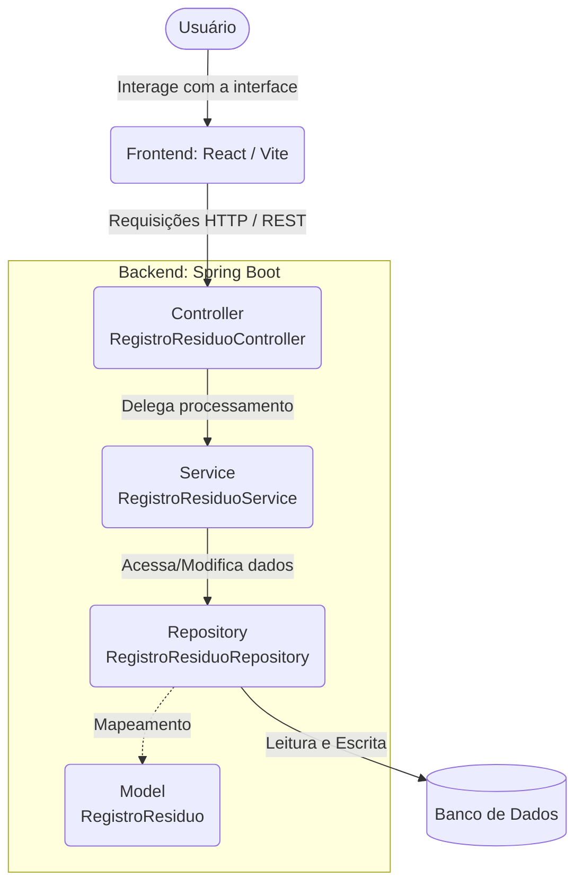

# EcoRecicla — Sistema de Monitoramento de Resíduos e Reciclagem

> Plataforma completa para gestão e monitoramento de descarte e reciclagem municipal, com backend em Java/Spring Boot e frontend em React + TypeScript.

---

## Índice

- [Sobre o Projeto](#sobre-o-projeto)
- [Funcionalidades](#funcionalidades)
- [Tecnologias](#tecnologias)
- [Pré-requisitos](#pré-requisitos)
- [Instalação e Execução](#instalação-e-execução)
  - [Backend](#backend-api)
  - [Frontend](#frontend-web)
- [Endpoints da API](#endpoints-da-api)
- [Estrutura do Projeto](#estrutura-do-projeto)
- [Modelo de Dados](#modelo-de-dados)
- [Configuração de CORS](#configuração-de-cors)

---

## Sobre o Projeto

O **EcoRecicla** é uma solução web para o gerenciamento de registros de resíduos sólidos por município brasileiro. O sistema permite cadastrar, visualizar, editar e excluir dados de geração de resíduos, com suporte a paginação, busca por texto e filtragem por estado.

O projeto foi desenvolvido com uma arquitetura cliente-servidor clássica: um backend RESTful em Java expõe uma API consumida por um frontend SPA em React.

---

## Funcionalidades

**Gestão de Registros (CRUD completo)**
- Cadastro de novos registros de descarte por município
- Listagem paginada de todos os registros monitorados
- Edição de registros existentes via modal
- Exclusão segura com confirmação visual

**Busca e Filtros**
- Pesquisa por nome do município (busca parcial, case-insensitive)
- Filtro por estado (UF) com dropdown de todos os 27 estados brasileiros
- Combinação simultânea de busca por texto e filtro de estado
- Controle de quantidade de registros exibidos por página (10, 25 ou 50)

**Paginação**
- Navegação por páginas com botões anterior/próximo
- Exibição inteligente de páginas com reticências para grandes conjuntos de dados
- Reset automático para a página 1 ao aplicar novos filtros

**Tratamento de Erros**
- Validação de campos obrigatórios no backend (município, estado, ano)
- Respostas de erro padronizadas com status HTTP, código e mensagem
- Exibição de alertas no frontend para falhas de comunicação

---

## Tecnologias

### Backend

| Tecnologia | Versão | Finalidade |
|---|---|---|
| Java | 17 | Linguagem principal |
| Spring Boot | 4.0.6 | Framework web (WebMVC) |
| Spring Data MongoDB | — | Persistência e consultas |
| Lombok | — | Redução de boilerplate (getters, setters, construtores) |
| Maven | — | Gerenciamento de dependências e build |

### Frontend

| Tecnologia | Versão | Finalidade |
|---|---|---|
| React | 19 | Framework UI |
| TypeScript | ~6.0 | Tipagem estática |
| Vite | 8.x | Tooling e servidor de desenvolvimento |
| Axios | 1.x | Requisições HTTP |
| Lucide React | 1.x | Ícones SVG |

---

## Pré-requisitos

Antes de iniciar, certifique-se de ter instalado em seu ambiente:

- **JDK 17** ou superior — [Download](https://adoptium.net/)
- **Apache Maven** configurado no `PATH` — [Download](https://maven.apache.org/download.cgi)
- **Node.js v18+** — [Download](https://nodejs.org/)
- **MongoDB** rodando localmente na porta padrão `27017` ou Atlas — [Download](https://www.mongodb.com/try/download/community)

---

## Instalação e Execução

Clone o repositório:

```bash
git clone https://github.com/seu-usuario/ecorecicla.git
cd ecorecicla
```

### Backend (API)

1. Acesse a pasta do backend:

```bash
cd backend
```

2. Certifique-se de que o MongoDB está ativo. Verifique ou ajuste as configurações em `src/main/resources/application.properties`:

```properties
server.port=8080
spring.data.mongodb.uri=mongodb://localhost:27017/ecorecicla (ou string de conexão para o Atlas)
```

3. Compile e execute a aplicação:

```bash
mvn clean install
mvn spring-boot:run
```

A API estará disponível em `http://localhost:8080`.

---

### Frontend (Web)

1. Em outro terminal, acesse a pasta do frontend:

```bash
cd frontend
```

2. Instale as dependências:

```bash
npm install
```

3. Inicie o servidor de desenvolvimento:

```bash
npm run dev
```

4. Acesse a aplicação em `http://localhost:5173`.

> **Atenção:** A URL da API está definida como constante `API_URL` em `frontend/src/App.tsx`. Se você alterar a porta do backend, atualize esse valor também.

---

## Endpoints da API

Base URL: `http://localhost:8080/api/residuos`

| Método | Endpoint | Descrição | Parâmetros |
|---|---|---|---|
| `GET` | `/` | Lista registros paginados com filtros opcionais | `termo`, `estado`, `page`, `size` |
| `GET` | `/{id}` | Busca um registro pelo ID | — |
| `GET` | `/estado/{uf}` | Lista todos os registros de um estado (sem paginação) | — |
| `POST` | `/` | Cria um novo registro | Body: `RegistroResiduo` (JSON) |
| `PUT` | `/{id}` | Atualiza um registro existente | Body: `RegistroResiduo` (JSON) |
| `DELETE` | `/{id}` | Remove um registro pelo ID | — |

**Exemplo de requisição `GET /api/residuos`:**

```
GET /api/residuos?termo=campinas&estado=SP&page=0&size=10
```

**Exemplo de body para `POST` / `PUT`:**

```json
{
  "municipio": "Campinas",
  "estado": "SP",
  "residuos_total": "1540.75",
  "residuos_domiciliares_e_publicos": "1200.00",
  "ano": 2023
}
```

**Exemplo de resposta de erro (validação):**

```json
{
  "mensagem": "Campo 'municipio' é obrigatório."
}
```

**Exemplo de resposta de erro global:**

```json
{
  "status": 404,
  "erro": "Not Found",
  "mensagem": "Rota não encontrada: /api/residuos/xyz"
}
```

---

## Estrutura do Projeto

```
ecorecicla/
├── backend/
│   └── src/
│       └── main/
│           ├── java/com/example/demo/
│           │   ├── DemoApplication.java          # Entry point Spring Boot
│           │   ├── config/
│           │   │   └── WebConfig.java            # Configuração de CORS
│           │   ├── controller/
│           │   │   └── RegistroResiduoController.java  # Endpoints REST
│           │   ├── exception/
│           │   │   └── GlobalExceptionHandler.java     # Tratamento global de erros
│           │   ├── model/
│           │   │   └── RegistroResiduo.java       # Entidade MongoDB
│           │   ├── repository/
│           │   │   └── RegistroResiduoRepository.java  # Queries MongoDB
│           │   └── service/
│           │       └── RegistroResiduoService.java     # Regras de negócio
│           └── resources/
│               └── application.properties         # Configurações da aplicação
│
├── frontend/
│   └── src/
│       ├── App.tsx               # Componente principal, lógica de estado e chamadas API
│       ├── RegistroModal.tsx     # Modal de criação e edição de registros
│       ├── SelectEstado.tsx      # Componente de seleção de UF
│       ├── index.css             # Estilos globais
│       └── main.tsx              # Entry point React
│
└── README.md
```

---

## Modelo de Dados

**Coleção MongoDB:** `registros`

| Campo | Tipo | Obrigatório | Descrição |
|---|---|---|---|
| `id` | `String` | Auto (MongoDB) | Identificador único gerado automaticamente |
| `municipio` | `String` | Sim | Nome do município |
| `estado` | `String` | Sim | Sigla do estado (UF), ex: `SP`, `RJ` |
| `residuos_total` | `String` | Não | Quantidade total de resíduos gerados (em toneladas) |
| `residuos_domiciliares_e_publicos` | `String` | Não | Quantidade de resíduos domiciliares e públicos |
| `ano` | `Integer` | Sim | Ano de referência do registro |

---

## Configuração de CORS

O backend está configurado para aceitar requisições do frontend em desenvolvimento. As origens e métodos permitidos estão definidos em `WebConfig.java`:

```java
registry.addMapping("/**")
    .allowedOrigins("http://localhost:5173")
    .allowedMethods("GET", "POST", "PUT", "DELETE", "OPTIONS")
    .allowedHeaders("*")
    .allowCredentials(true);
```

Para deploy em produção, substitua `http://localhost:5173` pela URL real do seu frontend.

---

*Desenvolvido para facilitar a gestão ambiental e promover a sustentabilidade.*
